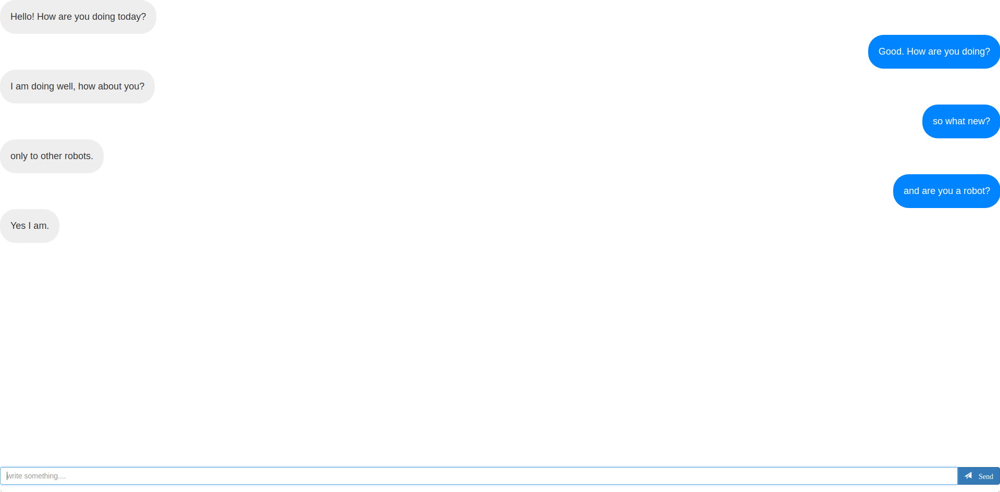

#ChattyBot - [A Chat Bot Messenger]
Chat anything with a bot on a IOS 10 texting like interface. This application has a standalone React JS client and standalone REST Python Flask server. 
 

The chatbot was built using <a href='https://github.com/gunthercox/ChatterBot'> ChatterBot. </a> 

Developed by <strong> Vaibhav Malhotra </strong>

<strong>Email: </strong> vbvmalhotra@gmail.com  

<h2>Run the project</h2>
<strong>Prerequisite: Make sure that you have python 3.6 with pip and Node JS with NPM installed in your system.
 </strong>
 
The following steps will let you download and run the project locally: 

1. Open up a terminal and clone the repository using  `git clone https://github.com/vmal/chatterBot.git`.
2. `cd` into the cloned dir and `cd` again into Client Dir.
3. Type `npm start` to run the Client Server. Your default browser should open up with the client running at `locahost:3000`
4. Open another instance of terminal and this time `cd` into Server Dir.
5. Run the following command to install the python dependencies `pip install -r requirements.txt`
6. After the installation run `flask run` to start up the Flask server which should be running on `localhost:5000`.
7. You can now successfully chat with a bot using the REACT JS app!

 <h2>Screenshot</h2>

 <h2>Live Demo</h2>
If you dont want to go through the hassle of running it locally, you can also access and play around with the app <a href='https://chatterbot-client.herokuapp.com/'>here</a>